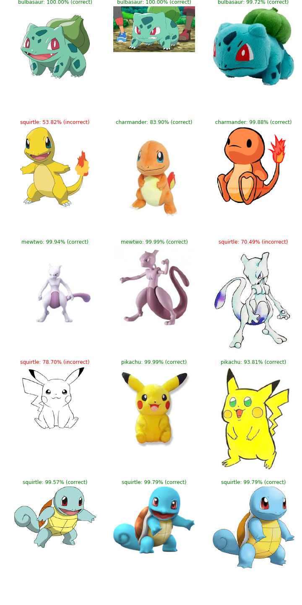

# pokedex
Building a Pokemon recognizer.

More than based on this [excellent article](
https://www.pyimagesearch.com/2018/04/16/keras-and-convolutional-neural-networks-cnns/?utm_source=mybridge&utm_medium=blog&utm_campaign=read_more) by Adrian Rosebrock.

Create a pokemon classifier from scratch using keras on top of tensorflow.
Steps:

### 1. Get training images:

   Download a good bunch of pokemon images using Bing search API. It requires an account of Microsoft Cognitive Services.

   Run `image_search_downloader.py` python script to download images with the following parameters:

  * directory --> Directory to save images into
  * max_results --> Max results to search for
  * file --> Txt file for search terms
  * apikey --> Bing search API key (you'll need your own key)
  
   Example: `python image_search_downloader.py -d images -m 250 -f search_terms.txt -k your_api_key_here`
  
   Refer to [this article](https://www.pyimagesearch.com/2018/04/09/how-to-quickly-build-a-deep-learning-image-dataset/) for further information and details
  
### 2. Training model:

   Train a Convolutional neural network (CNN) with the downloaded images. See `Build_Pokedex.ipynb` Jupiter Notebook for details and results on the training.

   After the training the model and the label binarizer are saved to be used in posterior classification.

### 3. Testing the model:

   Test the model with sample images (mine are in "examples" folder). The images can be classified using `classifier.py` python script with the following parameters:

  * model --> Path to trained model model
  * labelbin --> Path to label binarizer
  * image --> Path to input image
  Example: `python classifier.py -m pokedex.model -l lb.pickle -i examples/pikachu_01.png`

     `pokedex.model` file can be dowloaded [here](https://www.amazon.es/clouddrive/share/xRIHKaA1k1k8KRiQmZWliMUwXxq8IifpzsoWOv49EIt?_encoding=UTF8&%2AVersion%2A=1&%2Aentries%2A=0&mgh=1).
  
  The classification is also tested in `Test_classifier.ipynb` where different images are classified with diverse results:
  
  

Results are not awesome but this repository is only for practice and learning purposes.